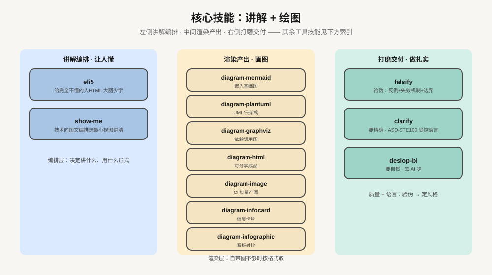
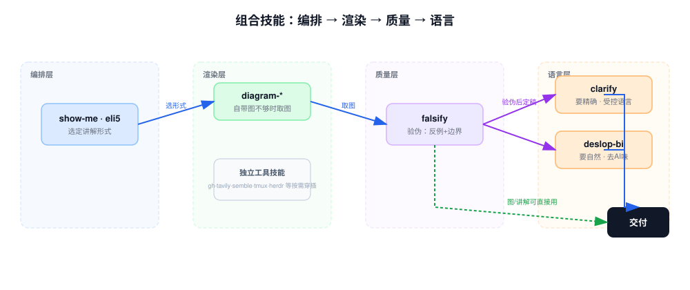

# skill-vault

[](./LICENSE)
[](https://github.com/Spoon94/skill-vault)
[](https://agentskills.io/specification)
[](#贡献)

> 个人收藏并整理的 AI 编程助手 **Agent Skills** 集合，按来源/主题分类组织，开箱即用。

每个 skill 都是一个独立目录。目录里有 `SKILL.md` 与它用到的资源（脚本、模板、参考文档）。每个 skill 都遵循 [Agent Skills 规范](https://agentskills.io/specification)。Claude Code、Codex CLI、Copilot CLI、Gemini CLI、OpenCode 等任何兼容 skills 的 AI 编程助手都能加载和调用它。

## 快速开始

```bash
git clone https://github.com/Spoon94/skill-vault.git
cp -r skill-vault/git-commit ~/.claude/skills/     # 以 Claude Code + git-commit 为例
```

**完整安装步骤见 [INSTALL.md](./INSTALL.md)**（含各平台目录、软链方式、批量安装、嵌套路径）。

## 技能全景



核心三条线：**讲解编排**（eli5 · show-me 让人懂）→ **渲染产出**（7 个 diagram-\* 画图）→ **打磨交付**（falsify 验伪 · clarify 精确 · deslop-bi 自然）。其余工具技能归入检索、流程、记忆、操作四类，见下方索引。

## 组合使用



流水线：**编排**（show-me / eli5 选讲解形式）→ **渲染**（diagram-\* 按需补图）→ **质量**（falsify 验伪）→ **语言**（clarify / deslop-bi 定风格）。独立工具技能（gh、tavily、tmux 等）按需穿插到任意环节。

**关键点**：

- `show-me` 自带内联 Mermaid 与聚焦 HTML。自带图够用时，你不要再叠 `diagram-*`。只有要 UML/云架构/DOT 边路由/成品文件时，你才升级到对应 `diagram-*`。
- `eli5` 的产物不要再过 `clarify`。eli5 要生动，clarify 要平实，两者方向冲突。`clarify` 与 `deslop-bi` 互斥：前者压平人味，后者恢复人味。
- `falsify` 的对象是论断/讲解/计划，不是纯渲染产物。`diagram-*` 只是按描述画图，没有可证伪的论断。

## 技能索引（63 个 · 按场景）

### 讲解与绘图（核心 14 个）

| 技能 | 用途 |
|------|------|
| [eli5](./eli5) | 给完全不懂的人：HTML 大图少字 |
| [show-me](./show-me) | 给技术人：编排图 + 短文讲清话题 |
| [diagram-mermaid](./diagram/diagram-mermaid) | 嵌入基础图（流程/时序/状态/ER 等 11 种） |
| [diagram-plantuml](./diagram/diagram-plantuml) | 专业图：UML/云架构/网络/安全/BPMN（图标库 9500+） |
| [diagram-graphviz](./diagram/diagram-graphviz) | 依赖树/调用图/包层级，细粒度边路由 |
| [diagram-html](./diagram/diagram-html) | 可分享的 HTML 成品图，双主题 + 一键导出 |
| [diagram-image](./diagram/diagram-image) | 命令行产 SVG/PNG，适合 CI/批处理 |
| [diagram-infocard](./diagram/diagram-infocard) | 单主题信息卡片，杂志级排版 |
| [diagram-infographic](./diagram/diagram-infographic) | KPI 看板/时间线/SWOT/漏斗/对比 |
| [falsify](./falsify) | 验伪：给产物强制加反例 + 失效机制 + 边界 |
| [clarify](./clarify) | 精确交付：中英均按 ASD-STE100 受控语言重写 |
| [deslop-bi](./deslop-bi) | 自然交付：去 AI 味，恢复人味 |
| [obsidian/defuddle](./obsidian/defuddle) | 从网页提取干净 Markdown，省 token |
| [obsidian/knap](./obsidian/knap) | 用模板 + 结构化数据批渲染 Markdown 笔记 |

### 开发流程（19 个）

| 技能 | 用途 |
|------|------|
| [superpowers/brainstorming](./superpowers/brainstorming) | 动手前：设计探索与需求澄清 |
| [superpowers/writing-plans](./superpowers/writing-plans) | 有规格后：写多步实施计划 |
| [superpowers/executing-plans](./superpowers/executing-plans) | 执行实施计划 |
| [superpowers/subagent-driven-development](./superpowers/subagent-driven-development) | 用子代理并行执行独立任务 |
| [superpowers/dispatching-parallel-agents](./superpowers/dispatching-parallel-agents) | 分发 2+ 个独立任务给并行代理 |
| [superpowers/test-driven-development](./superpowers/test-driven-development) | 写实现前：先写测试 |
| [superpowers/systematic-debugging](./superpowers/systematic-debugging) | 遇 bug/测试失败：系统化调试 |
| [superpowers/verification-before-completion](./superpowers/verification-before-completion) | 声称完工前：先验证 |
| [superpowers/requesting-code-review](./superpowers/requesting-code-review) | 合并前：请求代码审查 |
| [superpowers/receiving-code-review](./superpowers/receiving-code-review) | 收到审查意见后：先评估再改 |
| [superpowers/finishing-a-development-branch](./superpowers/finishing-a-development-branch) | 实现完成：收尾开发分支 |
| [superpowers/using-git-worktrees](./superpowers/using-git-worktrees) | 要隔离工作区时：用 git worktree |
| [superpowers/using-superpowers](./superpowers/using-superpowers) | 会话开始：如何发现和使用 skills |
| [superpowers/writing-skills](./superpowers/writing-skills) | 新建/编辑/校验 skill |
| [superpowers/diagnosing-superpowers](./superpowers/diagnosing-superpowers) | 复盘出问题的 superpowers 会话，生成 bug report |
| [git-commit](./git-commit) | 规范提交信息（Conventional Commits） |
| [worktrunk](./worktrunk) | Worktrunk（`wt`）worktree 管理、hooks、配置 |
| [hunk-review](./hunk-review) | 与 Hunk 交互式 diff 审阅会话协作 |
| [anthropics/skills/skill-creator](./anthropics/skills/skill-creator) | 创建/改进 skill，度量 skill 性能 |

### 检索与信息（5 个）

| 技能 | 用途 |
|------|------|
| [semble](./semble) | 代码语义检索，替代 grep+read，省 ~98% token |
| [tavily](./tavily) | 网页搜索/提取/爬取/研究，带引用 |
| [gh](./gh) | GitHub CLI 调用模式：结构化输出、分页、`gh api` 兜底 |
| [obsidian/obsidian-cli](./obsidian/obsidian-cli) | 通过 Obsidian CLI 读/建/搜 vault |
| [agentsview-cli](./agentsview-cli) | 本地 AI 会话历史：同步/搜索/成本报告 |

### 笔记与记忆（6 个）

| 技能 | 用途 |
|------|------|
| [engram-mem](./engram-mem) | 跨会话持久记忆（本地 SQLite，工作与生活通用） |
| [obsidian/obsidian-markdown](./obsidian/obsidian-markdown) | Obsidian Markdown：wikilinks/嵌入/callouts/properties |
| [obsidian/obsidian-bases](./obsidian/obsidian-bases) | Obsidian Bases（`.base`）：视图/过滤器/公式/汇总 |
| [obsidian/json-canvas](./obsidian/json-canvas) | JSON Canvas（`.canvas`）：节点/连线/分组 |
| [anthropics/skills/doc-coauthoring](./anthropics/skills/doc-coauthoring) | 结构化协同写作 |
| [anthropics/skills/internal-comms](./anthropics/skills/internal-comms) | 写各类内部沟通（周报/公告/FAQ） |

### 操作与集成（6 个）

| 技能 | 用途 |
|------|------|
| [tmux](./tmux) | 脚本化驱动 tmux：后台会话/send-keys/capture-pane |
| [herdr](./herdr) | Herdr CLI 控制终端多路复用器，协调 agent |
| [opencli](./opencli) | 把网站/Electron 应用/外部 CLI 变成统一操作面 |
| [mcp2cli](./mcp2cli) | 把 MCP/OpenAPI/GraphQL 变成 CLI |
| [anthropics/skills/mcp-builder](./anthropics/skills/mcp-builder) | 构建高质量 MCP 服务器 |
| [anthropics/skills/claude-api](./anthropics/skills/claude-api) | 构建/调试/优化 Claude API 与 Anthropic SDK 应用 |

### 文档与设计（12 个）

| 技能 | 用途 |
|------|------|
| [anthropics/skills/docx](./anthropics/skills/docx) | Word 文档创建/编辑 |
| [anthropics/skills/pdf](./anthropics/skills/pdf) | PDF 处理 |
| [anthropics/skills/pptx](./anthropics/skills/pptx) | PowerPoint 创建/编辑 |
| [anthropics/skills/xlsx](./anthropics/skills/xlsx) | Excel 表格创建/编辑 |
| [anthropics/skills/frontend-design](./anthropics/skills/frontend-design) | 前端视觉设计指引 |
| [anthropics/skills/web-artifacts-builder](./anthropics/skills/web-artifacts-builder) | 构建多组件 claude.ai HTML artifact |
| [anthropics/skills/webapp-testing](./anthropics/skills/webapp-testing) | 用 Playwright 测试本地 Web 应用 |
| [anthropics/skills/algorithmic-art](./anthropics/skills/algorithmic-art) | p5.js 算法艺术（种子随机） |
| [anthropics/skills/canvas-design](./anthropics/skills/canvas-design) | PNG/PDF 视觉艺术设计 |
| [anthropics/skills/brand-guidelines](./anthropics/skills/brand-guidelines) | 应用 Anthropic 官方品牌色与字体 |
| [anthropics/skills/theme-factory](./anthropics/skills/theme-factory) | 给 artifact（幻灯片/文档/网页）套主题 |
| [anthropics/skills/slack-gif-creator](./anthropics/skills/slack-gif-creator) | 制作适配 Slack 的动图 GIF |

> `anthropics/template`（脚手架模板）未列入索引 —— 它是新建 skill 的起点，不是可用技能。

## 安装方式

**agent 读 [INSTALL.md](./INSTALL.md)** —— 里面有按平台分步的安装指令。
人只需知道：把 skill 目录拷到平台的 skills 目录，或用 `npx skills add <repo-url>` 批量装。

## 与上游项目的差异

为保证开箱可用，本仓库对 vendored 内容维护以下本地不变式。任何上游同步都必须保住它们：

| # | 不变式 | 原因 | 影响范围 |
|---|--------|------|----------|
| I1 | `description` ≤ 1024 字符，超长时存裁剪版 | pi harness 硬限制，超出报 `description exceeds 1024 characters` | `diagram/diagram-{html,mermaid,plantuml}`（上游 1219/1159/1452 字符，本地为合规裁剪版） |
| I2 | `description` 含 `:` / 引号等 YAML 特殊字符时必须加引号 | 否则 YAML 解析报 `Nested mappings are not allowed in compact mappings` | `semble/SKILL.md`（上游未加引号，本地加了） |
| I3 | 引用仓库内相对路径扁平化 | 上游用仓库内相对路径，本地目录结构扁平 | `superpowers/brainstorming/SKILL.md` 中 `skills/brainstorming/visual-companion.md` → `visual-companion.md` |
| I4 | opencli 结构不同：上游 `OpenCLI/skills/` 下 7 个子技能（opencli-usage / opencli-browser / opencli-adapter-author / opencli-sitemap-author / opencli-browser-sitemap / opencli-autofix / smart-search）合并为单个 `opencli/SKILL.md` + `opencli/references/` | 统一入口，按任务类型路由，避免 7 个 skill 全部进上下文 | `opencli/` 全目录：去掉子技能 frontmatter，`references/` 路径前缀重写为本地布局（`adapter/`、`sitemap/`、`search/`） |
| I5 | opencli 的 strategy 术语有两套（references 的上游文档层大写术语 vs 运行时的小写 tag），`SKILL.md` 需维护映射表 | 上游文档与自家 CLI 输出脱节；本地需要让 agent 能把 references 术语和 `list -f json` 实际输出对上 | `opencli/SKILL.md`「术语对照」表 |
| I6 | `diagram/` 家族跨两个上游集合：`arch-diagram/diagram/` 的 4 个 `diagram-*` + `arch-diagram/skills/`（即 markdown-viewer/skills）的 3 个改名为 `diagram-*` 的目录（`diagram-graphviz` / `diagram-infocard` / `diagram-infographic`，上游裸名 graphviz / infocard / infographic） | 同属绘图技能集中放置便于路由与发现 | `diagram/diagram-{graphviz,infocard,infographic}/` |
| I7 | diagram 家族统一用 `diagram-*` 前缀命名，与上游 `markdown-viewer/skills` 的裸名（graphviz/infocard/infographic）不同 | 家族内命名一致性优先于上游保真；便于按名字定位 | `diagram/diagram-{graphviz,infocard,infographic}/`；下次同步这 3 个时需重做改名 + 改 `name` 字段补丁 |
| I8 | `worktrunk/reference/claude-code.md` 中关于 `wt-switch-create` 的描述保留上游原文，但加了「本仓库未收录」标注 | 该 skill 已删除（用户不需要），上游文本仍提及它；标注避免 agent 误以为可用 | `worktrunk/reference/claude-code.md` |

除上述不变式外，其余内容与各上游项目保持一致。

## 贡献

欢迎 PR 和 Issue：

- 新增 skill：请放在对应分类目录下。在本 README 表格中追加一行。
- 修复/改进现有 skill：建议先在 Issue 中讨论，再提 PR。
- 提交规范：遵循 [Conventional Commits](./git-commit)。

## License

[MIT](./LICENSE)
