# diagram-mermaid

Generate Mermaid code blocks (` ```mermaid ` fences) for inline Markdown rendering. Covers 11 diagram types — zero runtime dependencies, renders natively in GitHub, Obsidian, VS Code, and most Markdown viewers.

## Quick Start

1. **Classify the diagram type** from the user's request (see Routing table below)
2. **Read the matching example** in `examples/<type>.md` for that type's syntax patterns
3. **For complex syntax**: load `references/mermaid-syntax.md` for full grammar reference
4. **For layout issues**: load `references/layout-best-practices.md` (avoiding node overlap, arrow crossings)
5. **For special characters / long text**: load `references/common-pitfalls.md` (escaping, line breaks)
6. **Write Mermaid** between ` ```mermaid ` opening fence and ` ``` ` closing fence
7. **Run the self-review checklist** before delivering

## Critical Rules (apply to ALL diagram types)

- **Code fence**: ALWAYS use ` ```mermaid ` opening fence (lowercase). Close with ` ``` `.
- **First line**: the diagram type keyword (`flowchart`, `sequenceDiagram`, `classDiagram`, `stateDiagram-v2`, `erDiagram`, `gantt`, `pie`, `mindmap`, `timeline`, `gitGraph`, `journey`).
- **Direction** (flowchart only): `flowchart TD` (top-down, default), `flowchart LR` (left-right), `flowchart BT` (bottom-top), `flowchart RL` (right-left).
- **Node ID vs label**: `A[Label text]` — `A` is the ID (used in edges), `[Label text]` is the displayed text. Don't use reserved words (`end`, `subgraph`, `class`, `style`) as IDs.
- **Special characters in labels**: wrap label text in `"..."` if it contains `(`, `)`, `[`, `]`, `{`, `}`, `<`, `>`, `#`, `"`, `&`, or `|`. Example: `A["function(x, y)"]`.
- **Long text**: use `<br/>` for line breaks inside labels. Example: `A["First line<br/>Second line"]`.
- **Comments**: `%%` for single-line comments.
- **Styling**: `classDef name fill:#f9f,stroke:#333;` then `class nodeId name;` (or `class nodeId1,nodeId2 name;`).
- **Subgraphs** (flowchart): `subgraph Title\n  ... \nend` — wraps related nodes.

## Diagram Type Routing

When the user's request matches one of these, read the matching example first:

| Type | Trigger keywords | First line | Example file |
|---|---|---|---|
| **Flowchart** | 流程图、process、workflow、decision tree、流程 | `flowchart TD` | [`examples/flowchart.md`](examples/flowchart.md) |
| **Sequence** | 时序图、调用链、交互、message、API call | `sequenceDiagram` | [`examples/sequence.md`](examples/sequence.md) |
| **Class** | 类图、class diagram、inheritance、UML class | `classDiagram` | [`examples/class.md`](examples/class.md) |
| **State** | 状态图、state machine、lifecycle、状态机 | `stateDiagram-v2` | [`examples/state.md`](examples/state.md) |
| **ER** | ER图、entity、relationship、database schema、实体关系 | `erDiagram` | [`examples/er.md`](examples/er.md) |
| **Gantt** | 甘特图、project timeline、schedule、project plan | `gantt` | [`examples/gantt.md`](examples/gantt.md) |
| **Pie** | 饼图、pie chart、proportion、占比 | `pie` | [`examples/pie.md`](examples/pie.md) |
| **Mindmap** | 思维导图、brainstorm tree、concept map、脑图 | `mindmap` | [`examples/mindmap.md`](examples/mindmap.md) |
| **Timeline** | 时间线、timeline、chronology、历史 | `timeline` | [`examples/timeline.md`](examples/timeline.md) |
| **gitGraph** | git图、分支图、commit history、branch graph | `gitGraph` | [`examples/gitgraph.md`](examples/gitgraph.md) |
| **Journey** | 用户旅程、user journey、用户体验、customer journey | `journey` | [`examples/journey.md`](examples/journey.md) |

## Quick Examples

### Flowchart

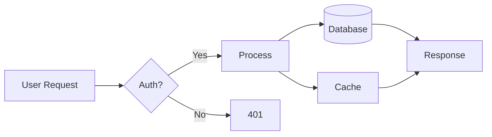

### Sequence

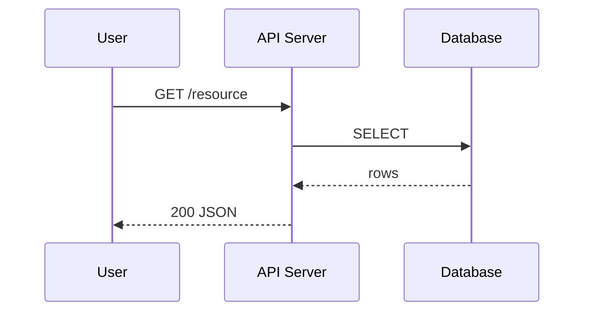

### Class

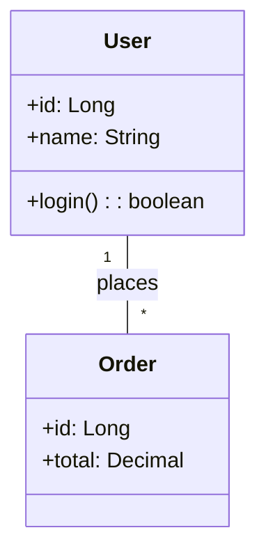

### State

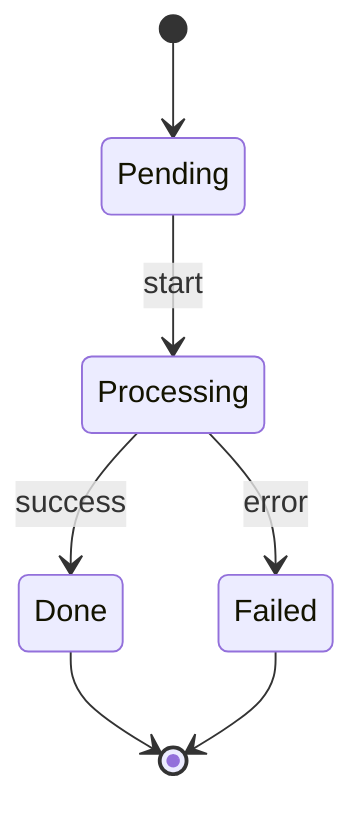

### ER

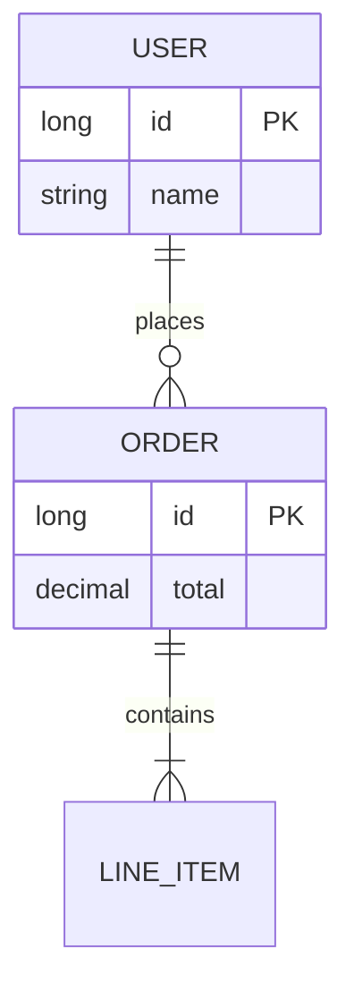

### Gantt

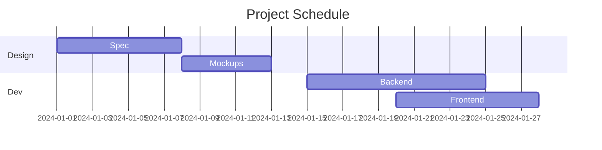

### Pie

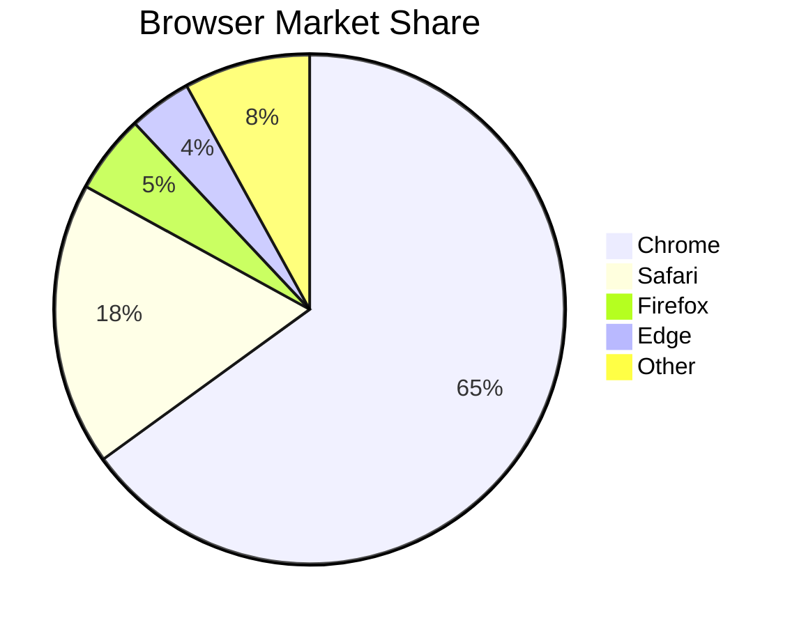

### Mindmap

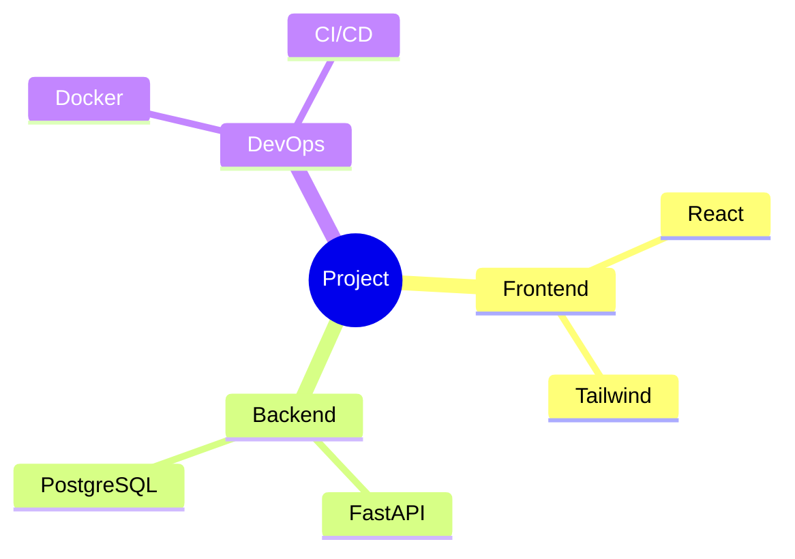

### Timeline

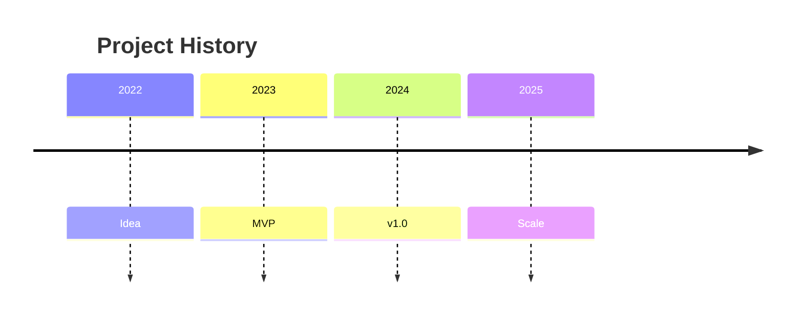

### gitGraph

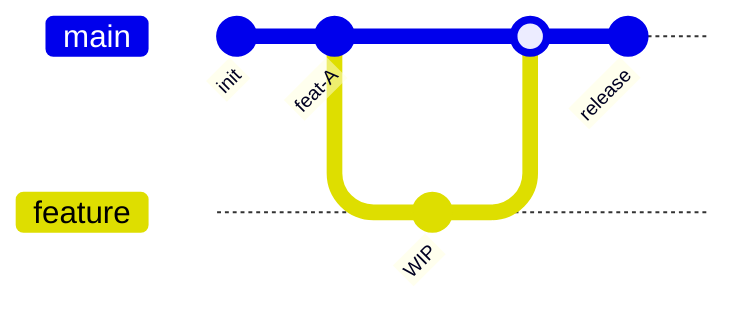

### Journey

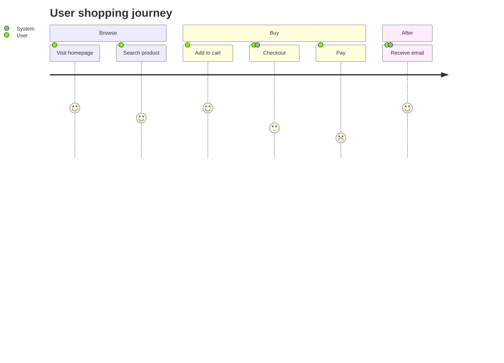

For more examples and the full syntax of each type, see `examples/<type>.mmd` and `references/mermaid-syntax.md`.

## 依赖与降级

| 依赖 | 必需性 | 缺失时行为 |
|---|---|---|
| 任何 Markdown 渲染器（GitHub / Obsidian / VS Code / Cursor 等） | 必需（用于渲染 Mermaid 代码块为图） | 代码块以纯文本展示——但 Mermaid 源码仍正确，可粘贴到在线渲染器 |
| 在线 Mermaid 渲染器（如 https://mermaid.live） | 可选（手动渲染备选） | 不影响生成本身；用户可粘贴代码到 mermaid.live 在线渲染 |

**关键：Mermaid 代码块永远可生成** — 本 skill 只产出文本代码块，零运行时依赖。GitHub 原生支持 Mermaid 渲染（README/issue/PR 评论里直接显示为图），Obsidian、VS Code（装 Mermaid 扩展）、Cursor、多数 Markdown 预览器也都原生支持。

### 兼容性提示

- **GitHub**：原生支持所有 11 种类型（2024 起含 mindmap、timeline、gitGraph、journey）
- **GitLab**：原生支持，但 mindmap/timeline 等新类型可能落后
- **Obsidian**：原生支持（需在设置里启用 Mermaid）
- **VS Code**：需装 `Markdown Preview Mermaid Support` 扩展
- **Cursor / Windsurf**：内置 Mermaid 支持
- **Notion**：不支持 Mermaid 代码块——这种场景请走 `diagram-html` 或 `diagram-image`

## 输出自检清单

交付前的最终检查清单：

### 代码块结构
- [ ] 以 ` ```mermaid ` 开头（小写，无空格在 mermaid 前）
- [ ] 以 ` ``` ` 结尾（独占一行）
- [ ] 内部第一行是图类型关键字（`flowchart`/`sequenceDiagram`/`classDiagram`/...）
- [ ] 无嵌套代码块导致 fence 冲突

### 语法正确性
- [ ] 节点 ID 简短、不与关键字冲突（不用 `end`、`subgraph`、`class`、`style`、`click` 等）
- [ ] 节点 label 中的特殊字符（`()`、`[]`、`{}`、`#`、`"`、`<`、`>`、`&`、`|`）已用 `"..."` 包裹
- [ ] 长文本用 `<br/>` 换行
- [ ] 箭头语法正确：`-->`、`---`、`-.->`、`==>`、`--x`、`--o`（flowchart）；`->>`、`-->>`、`-x`、`--x`（sequence）
- [ ] subgraph 有 `end` 闭合
- [ ] stateDiagram 用 `[*]` 表示开始/结束状态

### 内容质量
- [ ] 节点数量合理（flowchart ≤ 30 节点，sequence ≤ 10 参与者，class ≤ 20 类）
- [ ] label 文本清晰简洁
- [ ] 箭头方向与数据流方向一致
- [ ] 在 GitHub Markdown 预览或 mermaid.live 中无报错

### 布局质量
- [ ] 无节点重叠（必要时调整方向 TD/LR 或用 subgraph 分组）
- [ ] 无箭头交叉（必要时用 subgraph 隔离）
- [ ] 长链路拆分为多行/subgraph，避免单行长链

如以上任一项失败，参考 `references/layout-best-practices.md` 和 `references/common-pitfalls.md`。

## 相关技能

本 skill 是 diagram 技能家族的一员，按输出格式分工，4 个 skill 互补但不重叠：

| Skill | 输出形态 | 主用途 |
|---|---|---|
| `diagram-mermaid`（本 skill） | Mermaid 代码块（内联 Markdown） | GitHub README/issue/PR 嵌入，零依赖，GitHub 直接渲染，11 种基础图类型 |
| `diagram-plantuml` | PlantUML 代码块（内联 Markdown） | UML/云架构/网络拓扑/安全/ArchiMate/BPMN/数据管道/IoT/思维导图，9500+ 图标库 |
| `diagram-html` | 独立 HTML 文件 | 可分享的成品图，浏览器打开即用，双主题切换 + 浏览器导出菜单 |
| `diagram-image` | SVG + PNG 文件 | 命令行直接产出图片文件，适合 CI/批处理/嵌入不支持 SVG 的环境 |

**选用决策**：
- 在 Markdown 里嵌入图、要源码可读、可 diff → 本 skill（`diagram-mermaid`）或 `diagram-plantuml`
- 要可交互的 HTML 成品、双主题切换、点按钮导出 → `diagram-html`
- 要命令行直接出 SVG/PNG 文件、CI/批处理 → `diagram-image`

**默认推荐**：
- 简单 flowchart / sequence / state / ER / mindmap → 优先本 skill（最轻量，GitHub 原生渲染）
- 需要 AWS/Azure/GCP/Cisco 等专业图标或 BPMN/ArchiMate/IoT/UML 全家桶 → 优先 `diagram-plantuml`
- 要可分享的 HTML 成品 → `diagram-html`
- 要 SVG/PNG 文件 → `diagram-image`
