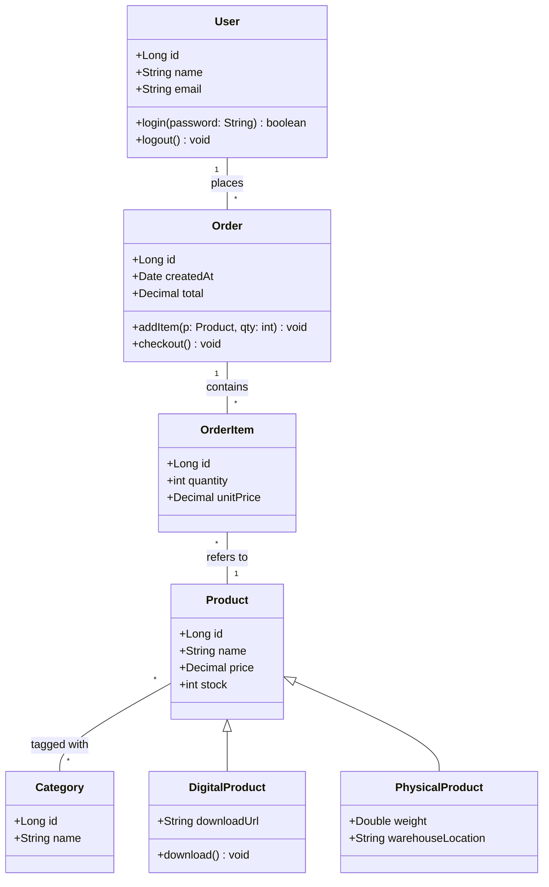

# Class Diagram Example

A class diagram for a simple e-commerce domain.

## Key syntax

- `class Name {\n  +member\n  +method()\n}` — class with members
- `+` public, `-` private, `#` protected, `~` package private
- `<\|--` — inheritance
- `*--` — composition (filled diamond)
- `o--` — aggregation (empty diamond)
- `-->` — association
- `..>` — dependency
- `"1" -- "*"` — multiplicity labels
- `: rel label` — relationship label

## Common variations

- `class List~T~` — generic class
- `<<interface>>` / `<<abstract>>` stereotypes
- `+method()* ReturnType` — abstract method
- `+method()$ ReturnType` — static method
