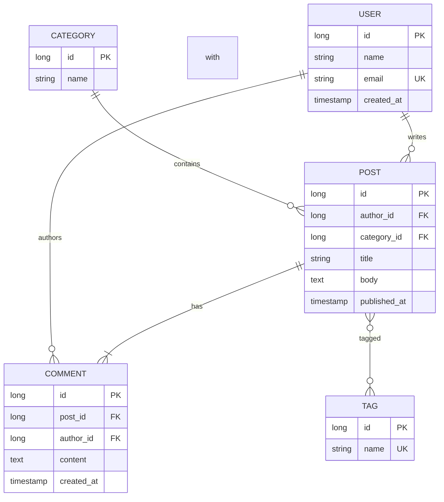

# ER Diagram Example

An entity-relationship diagram for a blog system.

## Key syntax

- `A ||--o{ B : rel_label` — one to zero-or-more
- `||--||` — one to one
- `||--|{` — one to one-or-more
- `}o--o{` — zero-or-more to zero-or-more
- `}|--|{` — one-or-more to one-or-more

## Attribute keys

- `PK` — primary key
- `FK` — foreign key
- `UK` — unique key
- (no suffix) — regular attribute

## Common variations

- `A ||--o{ B : "is in"` — quoted relationship label
- Attribute type can be any string: `long`, `string`, `text`, `timestamp`, `decimal`, etc.
