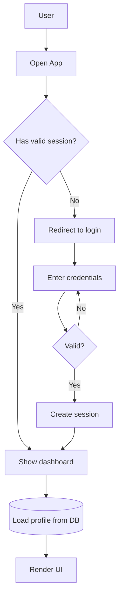

# Flowchart Example

A flowchart showing a typical user authentication flow with decision branches.

## Key syntax

- `flowchart TD` — top-down direction (also: `LR`, `BT`, `RL`)
- `A[Label]` — rectangle (default shape)
- `A{Label}` — rhombus (decision)
- `A[(Label)]` — cylinder (database)
- `C -- Yes --> D` — labeled edge (text on line)
- `G -- No --> F` — loop back edge

## Common variations

- `flowchart LR` for horizontal flows
- `subgraph Section\n  ...end` for grouping
- `classDef name fill:#f9f,stroke:#333;` + `class nodeId name;` for styling
