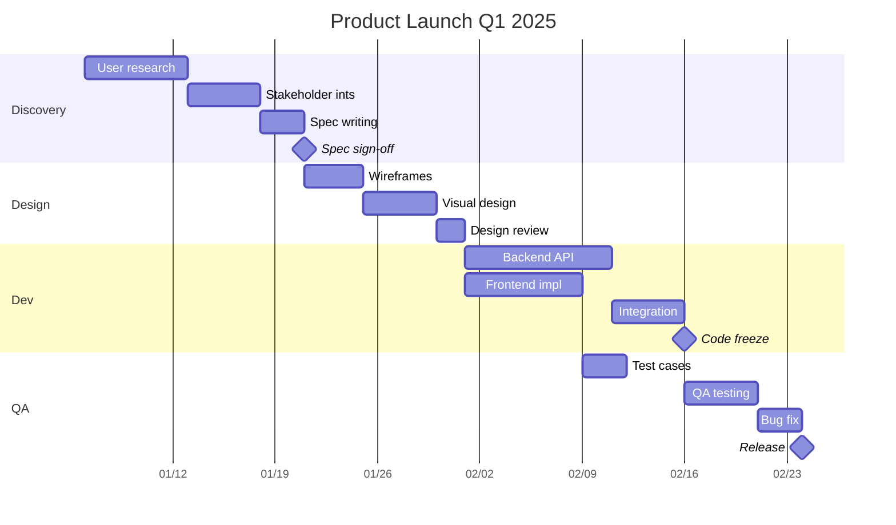

# Gantt Chart Example

A project schedule with multiple sections, dependencies, and milestones.

## Key syntax

- `gantt` — diagram type keyword
- `title` — chart title
- `dateFormat YYYY-MM-DD` — input date format
- `axisFormat %m/%d` — display date format
- `section Section Name` — group tasks
- `Task name :id, start, duration` — basic task
- `Task name :id, after other, duration` — dependent task
- `Task name :crit, id, start, duration` — critical (red)
- `Task name :done, id, ...` — completed
- `Task name :active, id, ...` — in-progress
- `Milestone name :milestone, id, date, 0d` — milestone (zero duration)

## Common variations

- `excludes weekends` — skip weekends
- `excludes friday` — skip specific weekdays
- `todayMarker off` — hide today line
- Multiple sections in one chart
