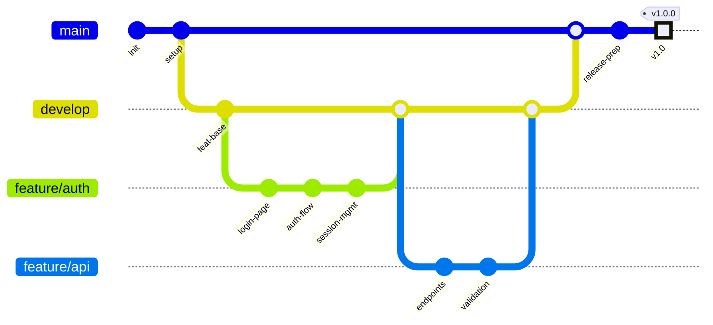

# gitGraph Example

A git branch graph showing feature branch workflow with merge and release tag.

## Key syntax

- `gitGraph` — diagram type keyword (default: horizontal LR)
- `commit id: "..."` — add commit on current branch with message
- `commit id: "..." tag: "v1.0"` — commit with tag
- `commit id: "..." type: HIGHLIGHT` — highlighted commit
- `branch Name` — create new branch
- `checkout Name` — switch to existing branch
- `merge Name` — merge branch into current

## Common variations

- `gitGraph LR:` — explicit left-right (default)
- `gitGraph BT:` — bottom-top (vertical)
- `cherry-pick id: "abc123"` — cherry-pick a commit
- `commit tag: "v1.0"` — tag-only commit
- Multiple `branch` / `checkout` / `merge` operations for complex workflows
