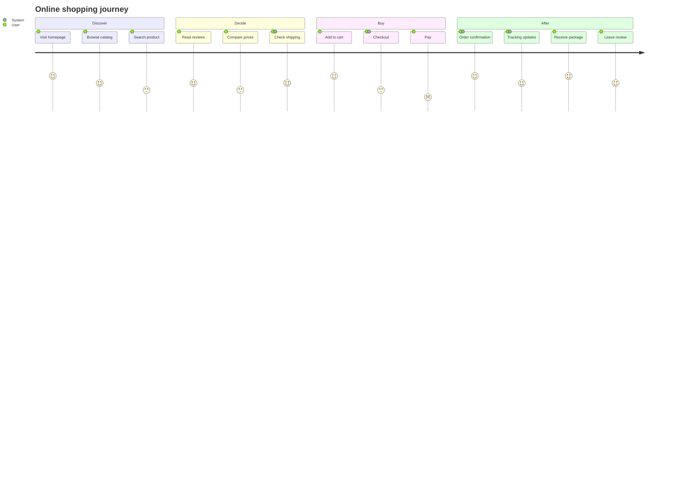

# Journey Example

A user journey map for an online shopping experience, with sentiment scores.

## Key syntax

- `journey` — diagram type keyword
- `title ...` — chart title
- `section Section Name` — group tasks
- `Task name: score: actor1, actor2` — task with sentiment (1-5) and actors

## Sentiment scores

- `1` — very negative (red)
- `2` — negative (orange)
- `3` — neutral (yellow)
- `4` — positive (light green)
- `5` — very positive (dark green)

Scores affect the color of each task in the rendered chart, making pain points visually obvious.

## Common variations

- Multiple actors per task (comma-separated)
- Custom section names (Discovery, Onboarding, Activation, etc.)
- Mix of high/low scores to highlight friction points
