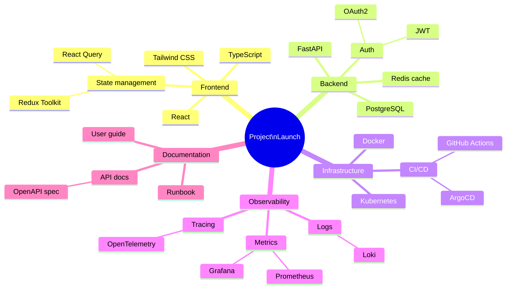

# Mindmap Example

A mindmap for planning a software project.

## Key syntax

- `mindmap` — diagram type keyword
- `root((Text))` — root node (circle)
- Indentation defines hierarchy (use 2 or 4 spaces, be consistent)
- `Node` — plain text
- `Node[Text]` — square
- `Node(Text)` — rounded
- `Node((Text))` — circle
- `Node{{Text}}` — bang (hexagon)

## Common variations

- Use `\n` for line breaks in labels
- Multi-line roots: `root((Project\nLaunch))`
- Mindmap supports up to 5-6 levels deep
- Each level can use different shapes for visual hierarchy
