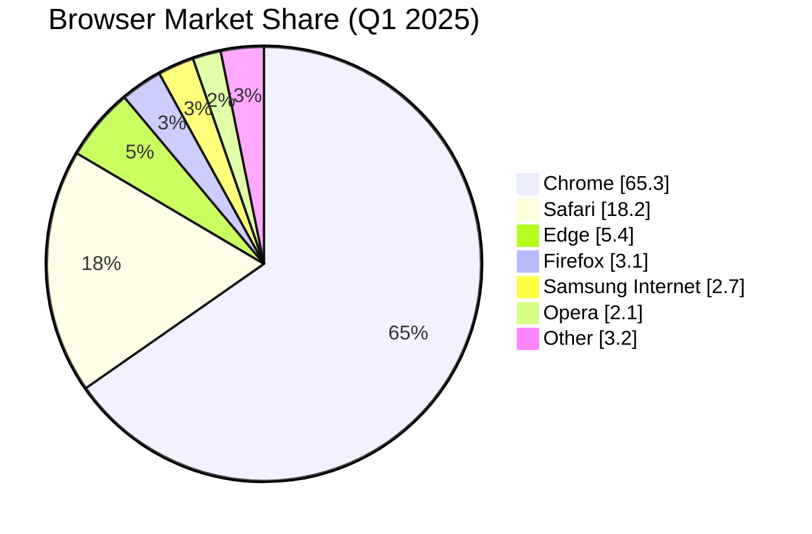

# Pie Chart Example

A pie chart showing browser market share.

## Key syntax

- `pie` — diagram type keyword
- `title ...` — chart title
- `showData` (optional) — display numeric values alongside slices
- `"Label" : value` — slice with label and numeric value (relative weights, not percentages)

## Common variations

- `pie title No data labels` — without `showData`, just slices
- Use decimal values like `65.3` — Mermaid normalizes them to 100%
- Labels must be quoted if they contain spaces
- Slice colors are auto-assigned; can be themed via config
