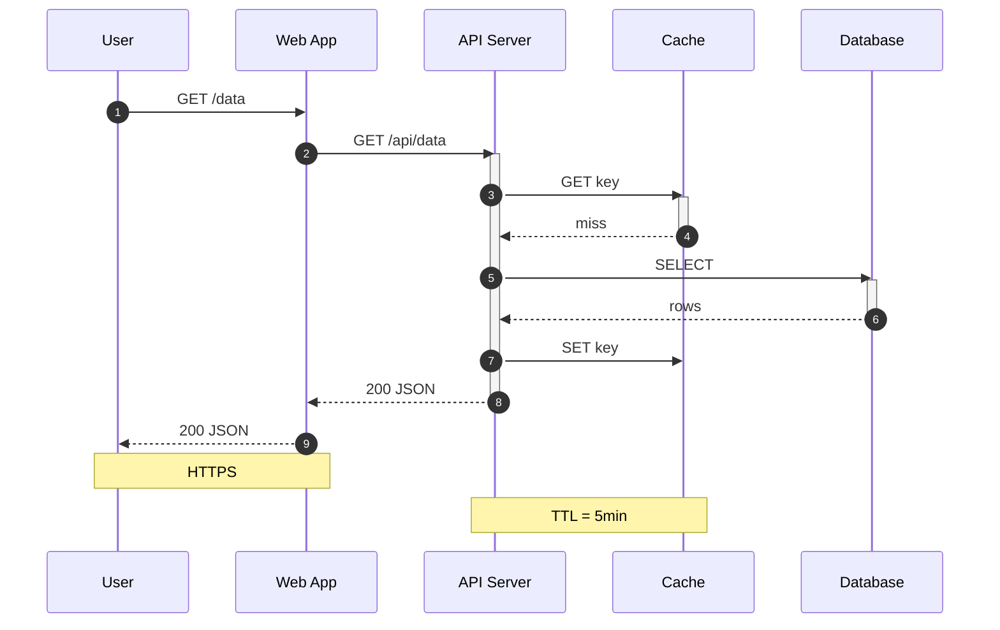

# Sequence Diagram Example

A sequence diagram showing a cache-miss request flow.

## Key syntax

- `participant Name as Alias` — declare participant with short alias
- `autonumber` — auto-number messages
- `A->>B: msg` — solid arrow with arrowhead
- `A-->>B: msg` — dotted arrow (return)
- `activate A` / `deactivate A` — lifeline activation
- `Note over A,B: text` — note spanning participants
- `loop`, `alt`/`else`, `opt` — control flow blocks

## Common variations

- `actor Name` instead of `participant` — stick figure
- `rect rgb(220,220,255)\n...end` — colored background region
- `loop N times\n...end` — loop block
