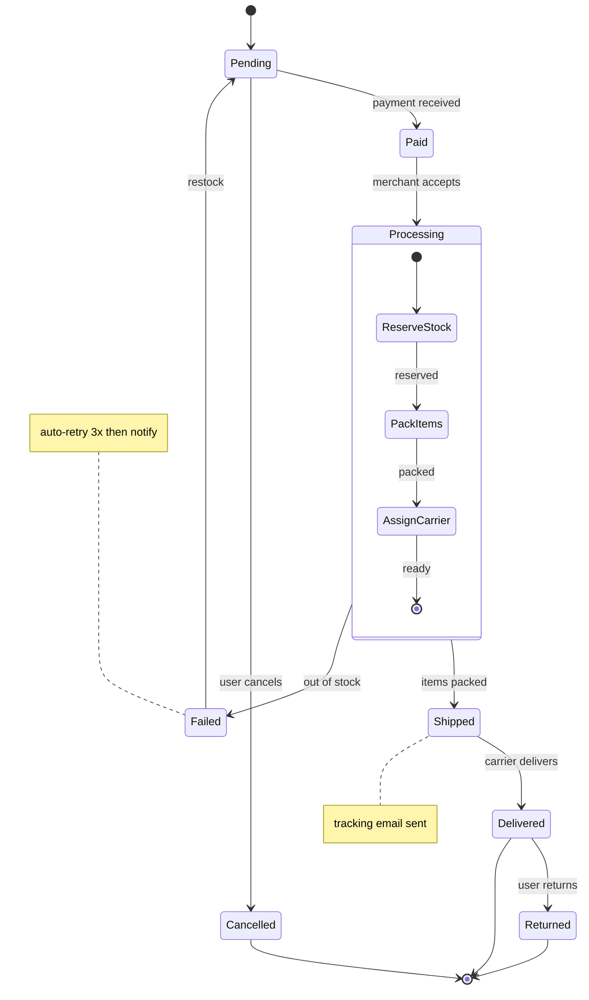

# State Diagram Example

A state machine for an order lifecycle, including retry and terminal states.

## Key syntax

- `stateDiagram-v2` — modern syntax (use this, not `stateDiagram`)
- `[*]` — initial/final pseudo-state
- `A --> B : event` — labeled transition
- `state Name {\n  ...\n}` — composite state
- `note left of X : text` — note attached to state

## Common variations

- `A --> B : event [condition]` — guarded transition
- `A --> B : event / action()` — transition with action
- `state Fork <<fork>>` — fork pseudo-state
- `state Join <<join>>` — join pseudo-state
- `note left of A : text\nmulti-line`
