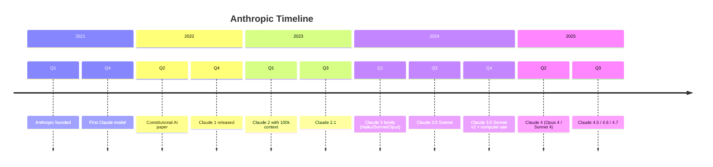

# Timeline Example

A timeline showing project milestones over multiple years.

## Key syntax

- `timeline` — diagram type keyword
- `title ...` — chart title
- `section Year` — group events by year/era
- `Period : event` — single event in a period
- `Period : event1 : event2 : event3` — multiple events (colon-separated)

## Time period formats

- `2024` — year
- `2024-Q1` — quarter
- `2024-03` — month
- `2024-03-15` — date
- `Week 5` — custom period

## Common variations

- Multiple sections per timeline
- Multi-event periods with `:` separator
- Mix of year/quarter/month periods in same timeline
