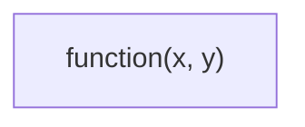
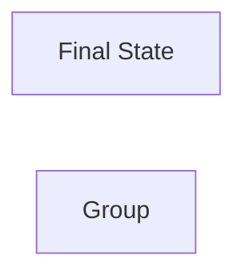
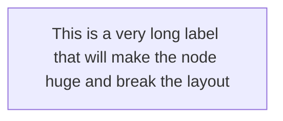
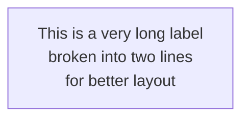
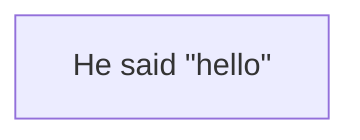
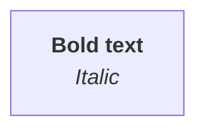
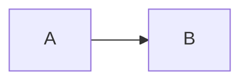
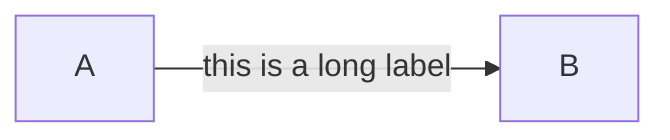
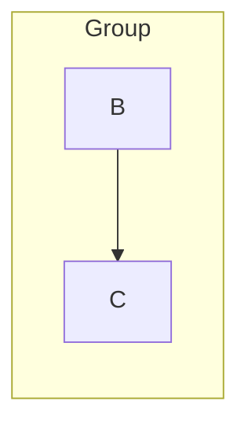
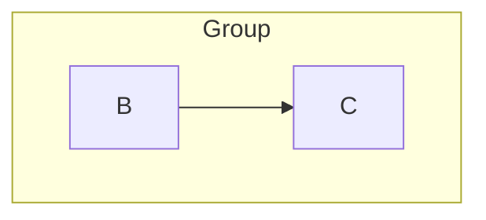

# Mermaid Common Pitfalls

Loaded on-demand when diagrams fail to render or look wrong. Most Mermaid errors come from special characters not being escaped, reserved word collisions, or long unbroken text.

## Table of Contents

1. [Special Character Escaping](#special-character-escaping)
2. [Reserved Words as IDs](#reserved-words-as-ids)
3. [Long Text & Line Breaks](#long-text--line-breaks)
4. [Quoting & HTML Entities](#quoting--html-entities)
5. [Edge Syntax Errors](#edge-syntax-errors)
6. [Subgraph Mismatch](#subgraph-mismatch)
7. [Mermaid Version Differences](#mermaid-version-differences)
8. [Renderer-Specific Quirks](#renderer-specific-quirks)

---

## Special Character Escaping

**Symptom**: Diagram fails to render or shows raw text instead of the diagram.

**Cause**: Mermaid uses these characters as syntax: `( ) [ ] { } < > # " & |`. If they appear in node labels unescaped, the parser breaks.

**Fix**: Wrap the label in double quotes `"..."`.

❌ Bad:
```mermaid
flowchart LR
    A[function(x, y)]
```

✅ Good:


### Specific characters

| Character | Issue | Fix |
|---|---|---|
| `(` `)` | Treated as rounded-rect shape | Wrap label in `"..."` |
| `[` `]` | Treated as rectangle shape | Wrap label in `"..."` |
| `{` `}` | Treated as rhombus (decision) | Wrap label in `"..."` |
| `<` `>` | Parsed as HTML tag | Wrap label in `"..."` or use `&lt;` `&gt;` |
| `#` | Parsed as color prefix | Wrap label in `"..."` |
| `"` | Parsed as string delimiter | Use `&quot;` or escape with `\` |
| `&` | Parsed as HTML entity start | Use `&amp;` |
| `\|` | Parsed as edge label delimiter | Wrap label in `"..."` |

### Special characters that are SAFE (no escaping needed)

- Letters, numbers, underscores, hyphens
- Spaces (inside `[]`/`()`/`{}` is fine)
- `:` `/` `.` `,` `;` `!` `?` `@` `$` `%` `^` `~`
- `+` `-` `*` `=` (math operators are fine in labels)

---

## Reserved Words as IDs

**Symptom**: Diagram renders partially, or unexpected behavior.

**Cause**: Using Mermaid reserved keywords as node IDs.

**Reserved words** (do NOT use as IDs):
- `end`, `subgraph`, `direction`, `class`, `classDef`, `style`, `click`
- `linkStyle`, `linkStyle default`
- `graph`, `flowchart`, `flowchart-v2`, `flowchart-elk`
- `sequenceDiagram`, `classDiagram`, `stateDiagram`, `erDiagram`
- `gantt`, `pie`, `mindmap`, `timeline`, `gitGraph`, `journey`
- `participant`, `actor`, `loop`, `alt`, `opt`, `rect`, `note`, `autonumber`, `activate`, `deactivate`
- `section`, `task`, `date`, `dateFormat`, `axisFormat`, `title`
- `branch`, `checkout`, `merge`, `commit`, `cherry-pick`

**Fix**: Use alternative names like `endNode`, `subgraphContainer`, `classA`, `styleNode`.

❌ Bad:
```mermaid
flowchart LR
    end[Final State]
    subgraph[Group]
```

✅ Good:


---

## Long Text & Line Breaks

**Symptom**: Label overflows its container, breaks the layout, or gets truncated.

**Cause**: Mermaid auto-sizes nodes to fit label text. Long labels force huge nodes.

**Fix**: Use `<br/>` to insert line breaks.

❌ Bad:


✅ Good:


### Recommended line length

- Soft limit: ~30 chars per line.
- Hard limit: ~50 chars per line.
- Break on natural boundaries (spaces, punctuation).

### Multi-line in different syntaxes

| Diagram type | Line break syntax |
|---|---|
| flowchart | `<br/>` |
| sequence | `<br/>` in Note text |
| class | `<br/>` in member definitions (rarely useful) |
| state | `\n` (in some renderers) or `<br/>` |
| ER | `<br/>` in attribute name |
| Gantt | (not applicable) |
| Pie | (not applicable) |
| Mindmap | `<br/>` or `\n` |
| Timeline | (not applicable) |

---

## Quoting & HTML Entities

**Symptom**: Quotes or HTML characters don't render correctly.

**Cause**: Mermaid supports HTML entities and inline HTML in some contexts.

### Quotes inside labels

- Use `&quot;` for `"` inside a label.



### HTML tags inside labels

- `<br/>`, `<b>`, `<i>`, `<u>`, `<s>`, `<sub>`, `<sup>`, `<font color="...">` work in flowchart labels.



### HTML entities

- `&amp;` → `&`
- `&lt;` → `<`
- `&gt;` → `>`
- `&quot;` → `"`
- `&#123;` → `{`
- `&#125;` → `}`
- `&nbsp;` → non-breaking space

---

## Edge Syntax Errors

**Symptom**: Edges don't render, or render in wrong direction.

### Common edge syntax mistakes

❌ Bad (missing arrowhead):
```mermaid
flowchart LR
    A -- B
```

✅ Good:


❌ Bad (text not in delimiters):


✅ Good (use `|...|`):


✅ Good (use quotes):


### Edge types

| Syntax | Meaning |
|---|---|
| `-->` | Solid arrow |
| `---` | Solid line (no arrow) |
| `===` | Thick line |
| `-.-` | Dotted line |
| `-.->` | Dotted arrow |
| `==>` | Thick arrow |
| `--x` | Arrow with X (rejected) |
| `--o` | Circle arrow |
| `~~~` | Invisible edge (no line, for layout) |

---

## Subgraph Mismatch

**Symptom**: "Parse error" or subgraph content doesn't render.

**Cause**: Missing `end` keyword, or `subgraph` and `end` not on their own lines.

❌ Bad:
```mermaid
flowchart LR
    subgraph A [Group] B --> C
```

✅ Good:


### Subgraph with explicit direction



### Nested subgraphs

- Limit nesting to 2 levels — dagre gets confused with deeper nesting.

---

## Mermaid Version Differences

**Symptom**: Works in one renderer, fails in another.

**Cause**: Different renderers use different Mermaid versions.

### Common version differences

| Feature | Min version |
|---|---|
| `flowchart` keyword (replaces `graph`) | v8.7+ |
| `stateDiagram-v2` | v8.11+ |
| `mindmap` | v9.2+ (still beta) |
| `timeline` | v9.4+ (still beta) |
| `gitGraph` (new syntax) | v10+ |
| `journey` | v9.0+ |
| `erDiagram` | v9.0+ |

### GitHub's Mermaid version

- GitHub uses the latest stable Mermaid (usually v10+).
- All 11 types in this skill should render on GitHub.

### GitLab / Notion / Obsidian

- GitLab: latest stable (similar to GitHub).
- Notion: does NOT support Mermaid — use diagram-html or diagram-image.
- Obsidian: native Mermaid support (enable in settings), uses bundled version.

---

## Renderer-Specific Quirks

### GitHub

- Supports `config:` frontmatter block for theme/look.
- `look: handDrawn` works.
- Mindmap/timeline render since late 2023.

### Obsidian

- Mermaid must be enabled in Settings → Markdown.
- Some themes have CSS that conflicts with Mermaid styles.
- `look: handDrawn` may not work in older versions.

### VS Code (with Markdown Preview Mermaid Support extension)

- Uses bundled Mermaid — may lag behind latest.
- Test before relying on bleeding-edge features.

### mermaid.live

- Always uses latest stable Mermaid.
- Best preview environment.
- Has "Edit in Mermaid Live" link generation.

### Notion / Slack / Google Docs

- Don't render Mermaid natively.
- Use `diagram-html` (Slack, Google Docs) or `diagram-image` (anywhere needing PNG).

---

## Quick Diagnostic Checklist

When a Mermaid diagram fails to render, check in order:

1. ✅ Code fence is ` ```mermaid ` (lowercase, no extra spaces).
2. ✅ First line is a valid diagram type keyword.
3. ✅ All node labels with special characters are wrapped in `"..."`.
4. ✅ No reserved words used as IDs.
5. ✅ All `subgraph` blocks have a matching `end`.
6. ✅ All edges have valid syntax (`-->`, `-->>`, `-.->`, etc.).
7. ✅ Long labels use `<br/>` for line breaks.
8. ✅ No nested code fences inside the Mermaid block.

If still failing: paste into https://mermaid.live — it shows the exact error line.
