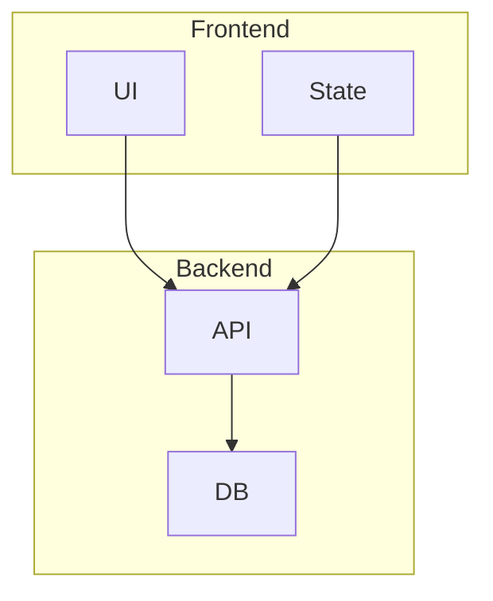
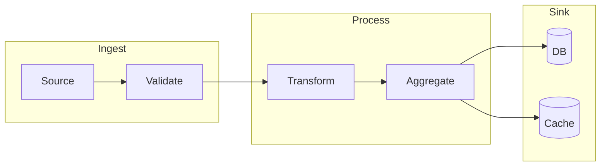
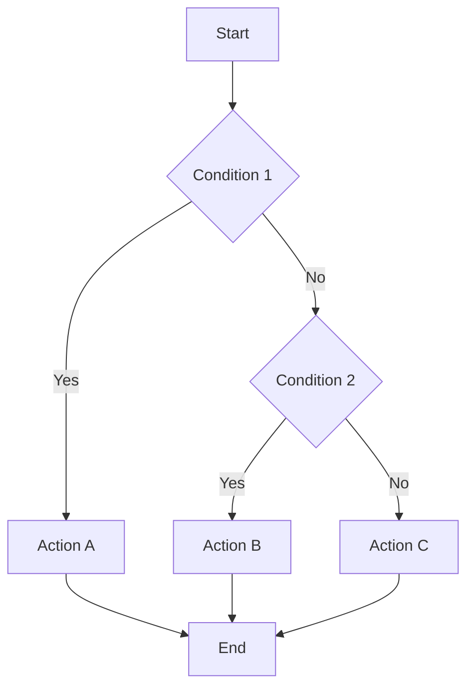
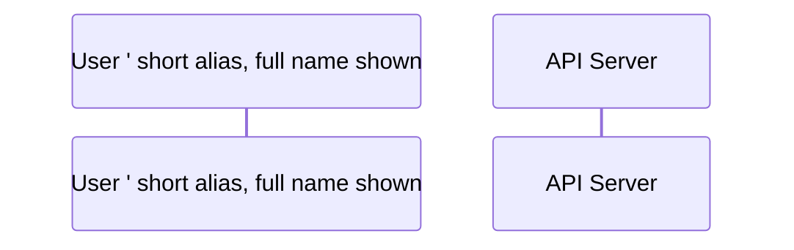

# Mermaid Layout Best Practices

Loaded on-demand when diagrams have layout issues (overlap, crossings, long chains). Mermaid uses dagre for auto-layout, so most issues can be fixed by adjusting direction, subgraphs, or breaking long chains.

## Common Layout Issues & Fixes

### 1. Node Overlap

**Cause**: Too many nodes in one row/column, dagre auto-fit fails.

**Fix options**:

1. **Switch direction**: `flowchart TD` ↔ `flowchart LR` — sometimes one direction fits the data better.
2. **Use subgraphs**: group related nodes into subgraphs to constrain layout.
3. **Reduce node count**: collapse 2-3 sequential nodes into one with ` ` separator.
4. **Use invisible edges**: `A ~~~ B` (no arrow, no line) — forces dagre to place B near A.

### 2. Arrow Crossings

**Cause**: Multiple edges that span across the diagram.

**Fix options**:

1. **Reorganize into subgraphs** — each subgraph has its own clean internal layout.
2. **Use `~~~` invisible edges** — guide dagre to place related nodes adjacent.
3. **Switch direction** — sometimes LR has fewer crossings than TD.
4. **Group with `subgraph`** — dagre keeps subgraph members close.

### 3. Long Chains

**Cause**: A → B → C → D → E → F... (long linear sequence).

**Fix options**:

1. **Break into subgraphs** — `section 1: A → B → C`, `section 2: D → E → F` (with one cross-graph edge).
2. **Switch to LR direction** — long chains look better horizontally.
3. **Use ` ` to merge** — if the chain is sequential steps of one process, merge into one node: `A["Step 1 Step 2 Step 3"]`.

### 4. Wide Diagrams

**Cause**: Many parallel branches.

**Fix options**:

1. **Use TD direction** — vertical stacking handles parallel branches better.
2. **Use subgraphs** — group parallel branches into one subgraph each.

### 5. Subgraph Layout Issues

**Cause**: subgraphs render with too much whitespace or nodes drift outside.

**Fix options**:

1. **Add `direction` inside subgraph**: `subgraph X\n  direction LR\n  ...end`.
2. **Set explicit `flowchart TD`** at top-level, not just `flowchart`.
3. **Avoid nesting subgraphs beyond 2 levels** — dagre gets confused.

## Direction Quick Reference

| Use case | Direction |
|---|---|
| Linear process / pipeline | `flowchart LR` |
| Hierarchical (org chart, decision tree) | `flowchart TD` |
| Wide horizontal relationships | `flowchart TD` (vertical stacking) |
| Tall vertical relationships | `flowchart LR` (horizontal stacking) |
| State machines | `stateDiagram-v2` (default direction) |
| Sequence / interaction | `sequenceDiagram` (always vertical) |

## Spacing Control

### Node spacing

Mermaid doesn't expose node-spacing directly, but you can:

1. Use longer labels — dagre allocates more space.
2. Use invisible padding nodes: `pad1[ ] ~~~ A ~~~ pad2[ ]` (creates whitespace).
3. Use HTML-style spacing via `classDef`: `classDef spaced padding:20px;`

### Edge label spacing

Edge labels (`A -- text --> B`) can overlap nodes. Fixes:

1. Use `|text|` syntax: `A -->|text| B` (renders label centered on edge).
2. Use shorter labels.
3. Move the label to a note (sequence/state only).

## Subgraph Patterns

### Pattern 1: Layered architecture

### Pattern 2: Pipeline

### Pattern 3: Decision tree

## Sequence Diagram Layout

### Avoiding message overlap

- Use `autonumber` to add message numbers — visual aid for long sequences.
- Add `Note` between message groups to break up the timeline visually.
- Use `rect rgb(220,220,255)\n...end` to highlight logical groups.

### Long participant names

### Loops & conditionals

- `loop N times\n...end`
- `alt Title\n...else\n...end`
- `opt Title\n...end`

## Class Diagram Layout

### Avoiding "spaghetti" inheritance

- Group by inheritance depth (parent at top, children below).
- Use `direction LR` for wide inheritance trees.
- Limit to ~10 classes per diagram — split into multiple if more.

### Multiplicity placement

- `A "1" --> "*" B` — cardinality labels go between the quotes.

## State Diagram Layout

### Composite states

- `state Active {\n  [*] --> Idle\n  Idle --> Working\n  Working --> [*]\n}` — keeps nested states clean.

### Avoiding arrow crossings

- Place `[*]` start at top, `[*]` end at bottom (vertical layout).
- Group transitions by event in notes.

## ER Diagram Layout

- Entity boxes are auto-placed — usually no manual layout needed.
- For 5+ entities, group related entities and add comments.

## Testing Your Layout

After writing Mermaid:

1. Paste into https://mermaid.live to preview.
2. If layout looks bad, try the fixes above.
3. Test in actual target environment (GitHub Markdown, Obsidian, etc.) — renderers can differ slightly.

## Common Pitfalls (cross-reference)

See [`common-pitfalls.md`](common-pitfalls.md) for special character escaping, long text wrapping, and other syntax issues that can break rendering.
