# Mermaid Full Syntax Reference

Loaded on-demand when the master SKILL.md doesn't have enough detail. For the most up-to-date and complete syntax, see https://mermaid.js.org/intro/.

## Table of Contents

1. [Flowchart](#flowchart)
2. [Sequence Diagram](#sequence-diagram)
3. [Class Diagram](#class-diagram)
4. [State Diagram](#state-diagram)
5. [ER Diagram](#er-diagram)
6. [Gantt Chart](#gantt-chart)
7. [Pie Chart](#pie-chart)
8. [Mindmap](#mindmap)
9. [Timeline](#timeline)
10. [gitGraph](#gitgraph)
11. [Journey](#journey)

---

## Flowchart

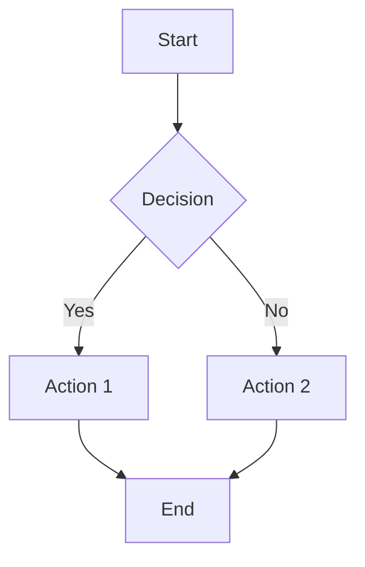

### Direction

- `flowchart TD` or `flowchart TB` — top-down (default)
- `flowchart LR` — left to right
- `flowchart BT` — bottom to top
- `flowchart RL` — right to left

### Node shapes

| Syntax | Shape |
|---|---|
| `id[Text]` | Rectangle (default) |
| `id(Text)` | Rounded rectangle |
| `id((Text))` | Circle |
| `id>Text]` | Flag (asymmetric) |
| `id{Text}` | Rhombus (decision) |
| `id[[Text]]` | Subroutine (double-rectangle) |
| `id[(Database)]` | Cylinder (database) |
| `id[/Text/]` | Parallelogram (input) |
| `id[\Text\]` | Parallelogram alt (output) |
| `id((Text))` | Circle |
| `id>Text]` | Asymmetric |
| `id{{Text}}` | Hexagon |
| `id[/Text\]` | Trapezoid alt |
| `id[\Text/]` | Trapezoid |
| `id(((Text)))` | Double circle |

### Edges

| Syntax | Meaning |
|---|---|
| `-->` | Solid arrow |
| `---` | Solid line (no arrow) |
| `===` | Thick line |
| `-.-` | Dotted line |
| `-.->` | Dotted arrow |
| `==>` | Thick arrow |
| `--x` | Arrow with X |
| `--o` | Circle arrow |
| `-- Edge text -->` | Labeled edge |
| `A -->|text| B` | Labeled edge (alt syntax) |
| `A -- text --> B` | Labeled edge (alt syntax) |

### Subgraphs

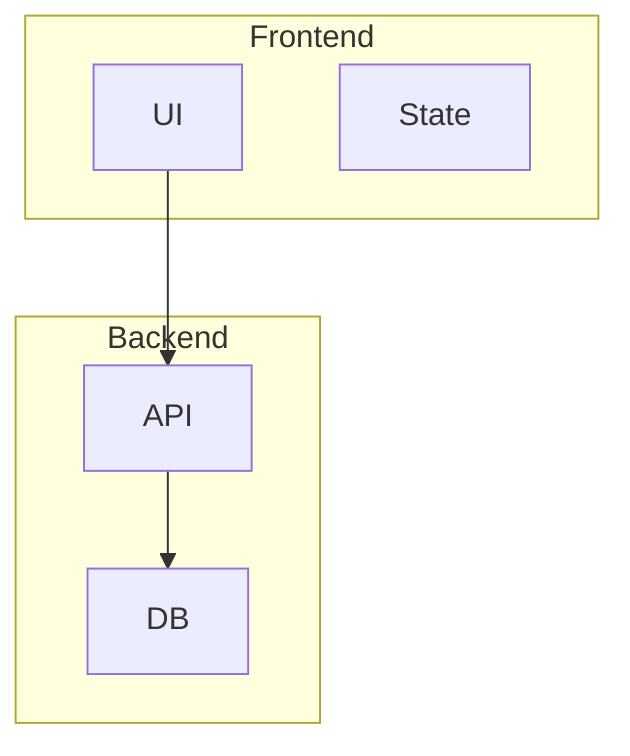

### Styling

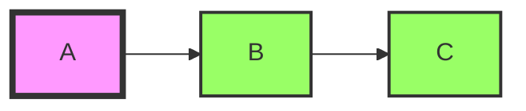

---

## Sequence Diagram

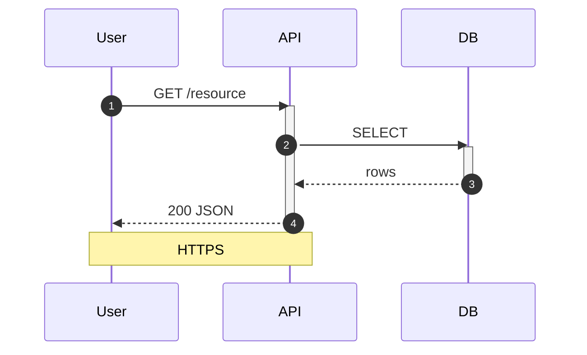

### Participant types

- `participant Name` — basic
- `actor Name` — stick figure
- `participant Name as Alias` — with alias
- `box rgba(0,0,255,0.1) Title\n... end` — group participants

### Message types

- `->>` — solid line with arrowhead
- `-->>` — dotted line with arrowhead
- `--)` — dotted line with open arrow (async)
- `->` — solid line without arrowhead
- `--` — dotted line without arrowhead
- `-x` — solid line with X (rejected)

### Activations / Lifelines

- `activate A` / `deactivate A` — start/end a lifeline
- `A->>B+: msg` / `A->>B-: msg` — short syntax for activate/deactivate

### Notes

- `Note left of A: text` — note left of participant
- `Note right of A: text` — note right of participant
- `Note over A: text` — note over participant
- `Note over A,B: text` — note spanning multiple participants

### Loops / conditionals

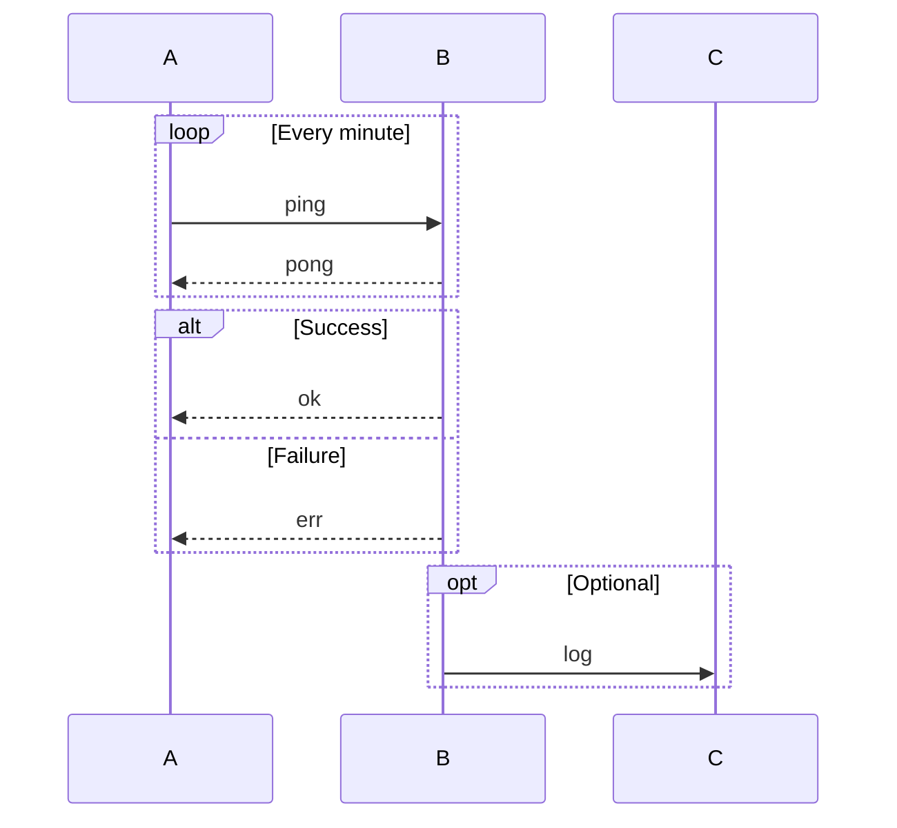

### Background highlights

- `rect rgb(200,220,255)\n... end` — colored background for a region

---

## Class Diagram

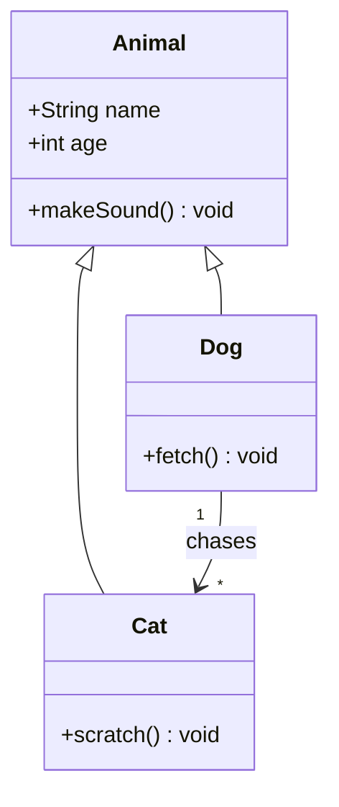

### Class members

- `+name: Type` — public
- `-name: Type` — private
- `#name: Type` — protected
- `~name: Type` — package private
- `+method(): ReturnType` — method
- `+method()* ReturnType` — abstract method
- `+method()$ ReturnType` — static method

### Relationships

- `<\|--` — inheritance
- `*--` — composition
- `o--` — aggregation
- `-->` — association
- `..>` — dependency
- `..|>` — realization
- `--` — solid link (no direction)

### Multiplicity

- `Animal "1" --> "*" Dog` — one to many
- `Animal "1" --> "1..*" Dog` — one to one-or-more
- `Animal "1" --> "0..1" Dog` — one to zero-or-one

### Generics

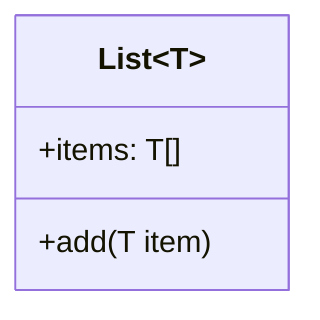

---

## State Diagram

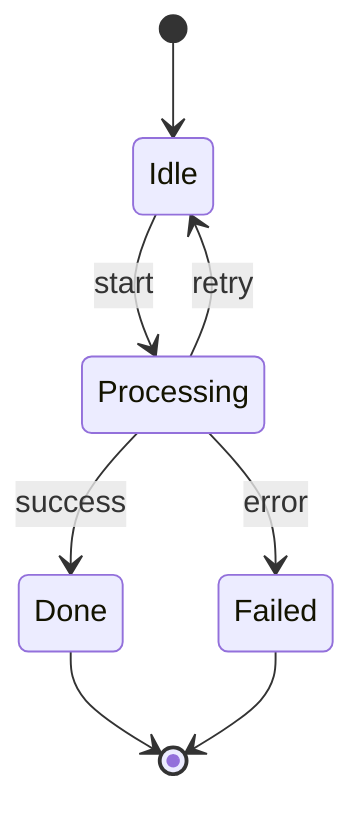

### Composite states

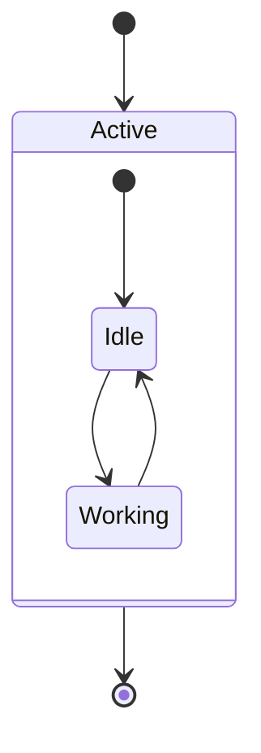

### Transitions

- `A --> B : event` — labeled transition
- `A --> B : event / action()` — transition with action
- `A --> B : event [condition]` — guarded transition

### Notes

- `note left of A : text`
- `note right of A : text`
- `note left of A : text\nmulti-line`

### Fork / Join

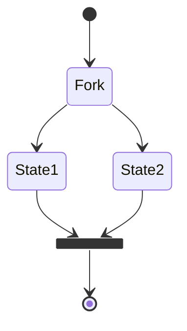

---

## ER Diagram

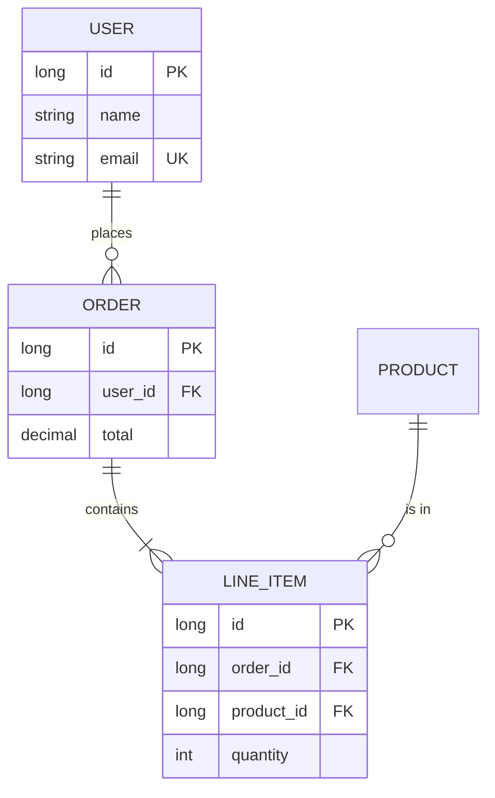

### Cardinality

- `||--||` — one to one
- `||--o{` — one to zero-or-more
- `||--|{` — one to one-or-more
- `}o--o{` — zero-or-more to zero-or-more
- `}|--|{` — one-or-more to one-or-more

### Attributes

- `long id PK` — primary key
- `long user_id FK` — foreign key
- `string email UK` — unique key
- `int age` — regular attribute

---

## Gantt Chart

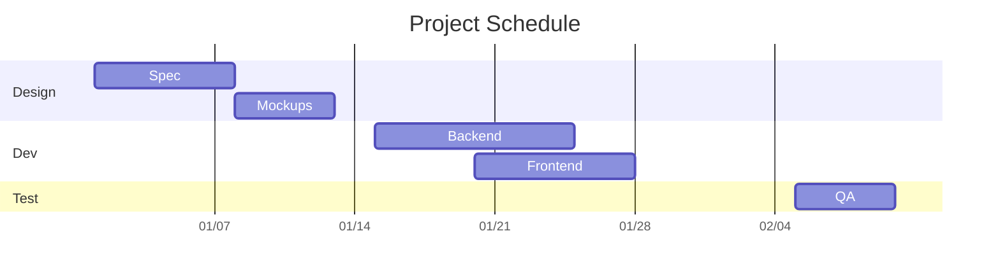

### Task syntax

- `Task name :id, start, duration`
- `Task name :id, after other, duration`
- `Task name :crit, id, start, duration` — critical task
- `Task name :done, id, start, duration` — completed task
- `Task name :active, id, start, duration` — in-progress task

### Section

- `section Section Name` — groups tasks

### Milestones

- `Milestone :milestone, id, date, 0d`

### Excluding weekends

- `excludes weekends`
- `excludes monday,friday`

---

## Pie Chart

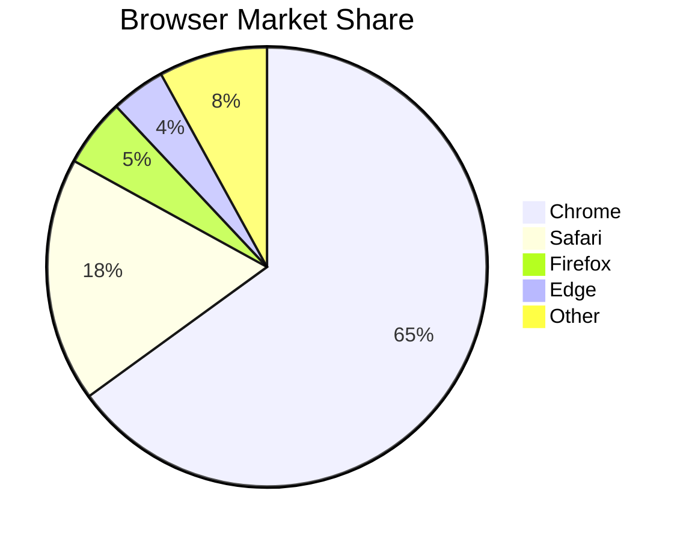

### Theme

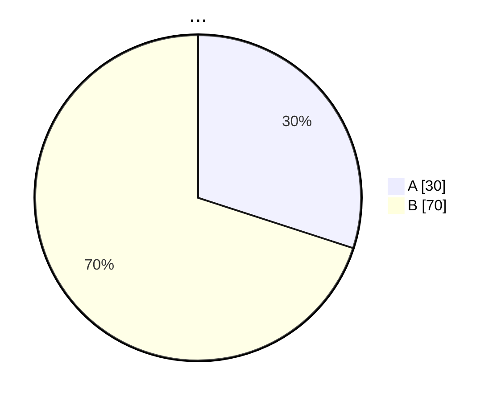

- `showData` — show numeric values
- `title` — chart title (one line)

---

## Mindmap

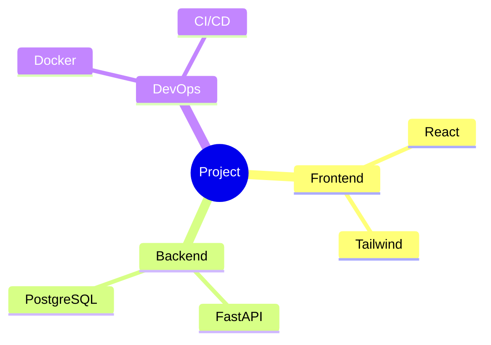

### Node shapes

- `id` — plain text
- `id[Text]` — square
- `id(Text)` — rounded
- `id((Text))` — circle
- `id{{Text}}` — bang (hexagon)
- `id)Text(` — cloud
- `id))Text((` — burst

### Icons

- `id["Text\n🚀"]` — with emoji
- Use Font Awesome via `fa:fa-icon-name` syntax (when supported)

---

## Timeline

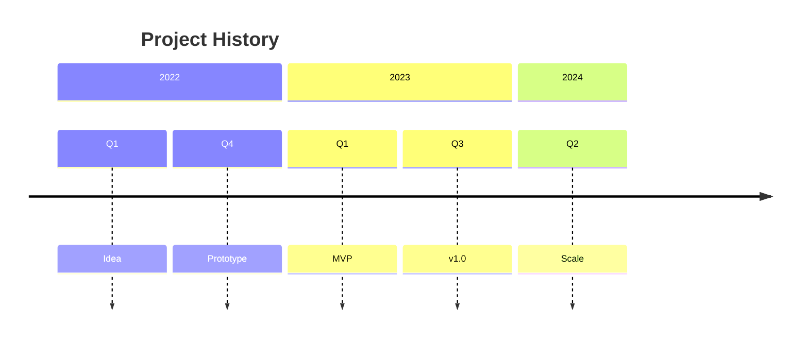

### Time period

- `2024 : event` — year
- `2024-Q1 : event` — quarter
- `2024-03 : event` — month
- `2024-03-15 : event` — date

### Multi-event per period

- `2024 : event 1 : event 2 : event 3`

---

## gitGraph

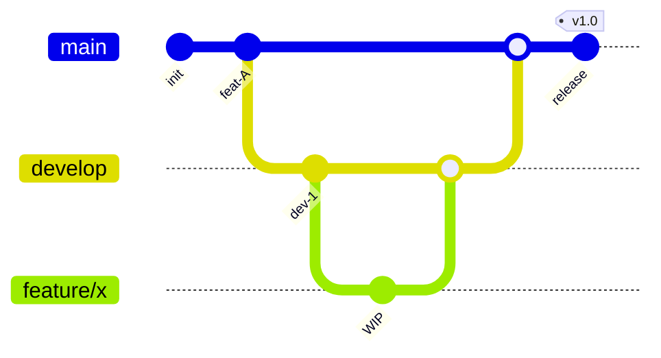

### Keywords

- `commit` — add a commit on current branch
- `branch Name` — create new branch
- `checkout Name` — switch to branch
- `merge Name` — merge branch into current
- `cherry-pick id: "abc123"` — cherry-pick a commit

### Commit options

- `commit id: "abc123"`
- `commit tag: "v1.0"`
- `commit type: HIGHLIGHT` — highlight commit
- `commit type: NORMAL` — normal (default)

### Horizontal vs vertical

- `gitGraph LR:` — left-right (default horizontal)
- `gitGraph BT:` — bottom-top (vertical)

---

## Journey

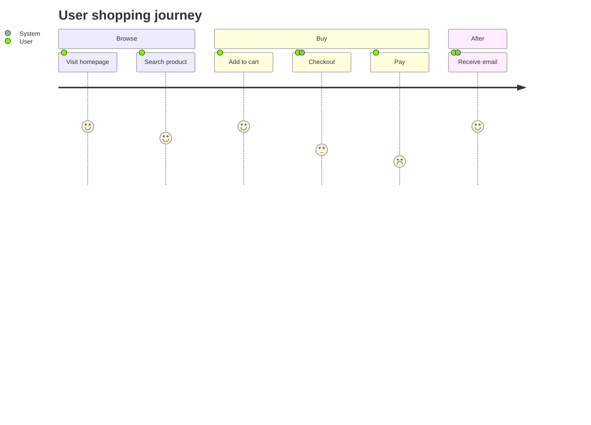

### Task line

- `Task name: score: actor1, actor2`

- `score` — 1 (low) to 5 (high), how the user feels
- `actor` — comma-separated list of participants

### Sections

- `section Section Name` — groups tasks

---

## Common Configuration

### Frontmatter (theme, look, etc.)

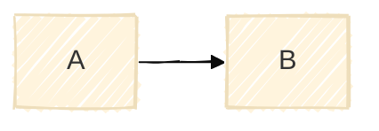

Themes: `default`, `base`, `dark`, `forest`, `neutral`, `null`
Looks: `classic` (default), `handDrawn`, `rect`
