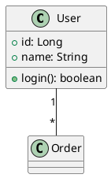
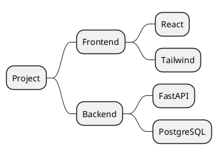

# diagram-plantuml

Generate PlantUML code blocks (` ```plantuml ` fences) for inline Markdown rendering. Covers 9 diagram domains via PlantUML syntax with 9500+ mxgraph stencil icons.

## Quick Start

1. **Classify the diagram domain** from the user's request (see Routing table below)
2. **Read the matching reference** in `references/<domain>.md` for that domain's keywords, syntax, and conventions
3. **Pick stencils** (cloud/network/security only) from `stencils/<provider>.md` if the diagram needs product icons
4. **Write PlantUML** between `@startuml` and `@enduml`, wrapped in a ` ```plantuml ` code fence
5. **Run the self-review checklist** before delivering

## Critical Rules (apply to ALL domains)

- Every diagram starts with `@startuml` and ends with `@enduml`
- **Code fence**: ALWAYS use ` ```plantuml ` or ` ```puml `. NEVER use ` ```text ` — it will NOT render as a diagram.
- **Direction**: `left to right direction` for typical cloud/architecture diagrams (data flows left→right); `top to bottom direction` for hierarchical (class/family trees, mindmaps); default is top-to-bottom.
- **Containers**: `package "Name" { ... }`, `rectangle "Name" { ... }`, `node "Name" { ... }`, `cloud "Name" { ... }`, `database "Name" { ... }`, `folder "Name" { ... }`
- **Arrows**: `-->` (directed, solid), `..>` (dashed, async/event), `<|--` (inheritance), `*--` (composition), `o--` (aggregation), `..|>` (realization), `--` (undirected)
- **Notes**: `note left of`, `note right of`, `note over`, or `note "text" as N`
- **Styling**: `skinparam backgroundColor #FFF`, `skinparam componentFontSize 12`, or per-element `#color` (e.g. `#LightBlue`, `#FF6600`)
- **Stencils (cloud/network/security)**: `mxgraph.<namespace>.<icon> "Label" as <alias>` — default colors are applied automatically; do NOT specify `fillColor`/`strokeColor` unless overriding

## Diagram Domain Routing

When the user's request matches one of these, read the matching reference first:

| Domain | Trigger keywords | Reference |
|---|---|---|
| **UML** | class/sequence/activity/state/component/use-case/deployment/object/package/communication/composite/interaction/profile diagram | [`references/uml.md`](references/uml.md) |
| **Cloud** | AWS/Azure/GCP/Alibaba/IBM/OpenStack/Kubernetes architecture, VPC, region, serverless, multi-cloud | [`references/cloud.md`](references/cloud.md) |
| **Network** | network topology, LAN/WAN, Cisco/Citrix devices, data center, enterprise network | [`references/network.md`](references/network.md) |
| **Security** | IAM, encryption, firewall, threat detection, compliance, zero-trust, security architecture | [`references/security.md`](references/security.md) |
| **ArchiMate** | enterprise architecture, business/application/technology layer, ArchiMate | [`references/archimate.md`](references/archimate.md) |
| **BPMN** | business process, workflow automation, EIP, value stream mapping, BPMN | [`references/bpmn.md`](references/bpmn.md) |
| **Data Analytics** | data pipeline, ETL/ELT, data warehouse, ML workflow, data lineage | [`references/data-analytics.md`](references/data-analytics.md) |
| **IoT** | smart home/factory, fleet management, digital twin, IoT device/sensor/edge | [`references/iot.md`](references/iot.md) |
| **Mindmap** | mindmap, brainstorm tree, study outline, decision map | [`references/mindmap.md`](references/mindmap.md) |

## Mxgraph Stencil Icons

9500+ icons are available via `mxgraph.<namespace>.<icon>` syntax. Default colors apply automatically.

**Full stencil reference**: see [`stencils/README.md`](stencils/README.md) for the icon lookup guide.

### Common stencil namespaces

| Namespace | Example icons | Stencil file |
|---|---|---|
| `mxgraph.aws4` | `lambda`, `api_gateway`, `dynamodb`, `ec2`, `rds`, `s3`, `vpc`, `cloudfront` | [`stencils/aws4.md`](stencils/aws4.md) |
| `mxgraph.azure` | `vm`, `sql_database`, `app_service`, `storage_blob` | [`stencils/azure.md`](stencils/azure.md) |
| `mxgraph.gcp` | `compute_engine`, `cloud_sql`, `pubsub`, `bigquery` | (find in stencils/) |
| `mxgraph.kubernetes` | `pod`, `svc`, `deploy`, `ing`, `cm`, `secret` | (find in stencils/) |
| `mxgraph.cisco` | `router`, `switch`, `firewall`, `load_balancer` | (find in stencils/) |
| `mxgraph.archimate3` | `business_actor`, `application_service`, `technology_artifact` | [`stencils/archimate3.md`](stencils/archimate3.md) |

### Stencil syntax

```plantuml
mxgraph.<namespace>.<icon> "Label" as <alias>
mxgraph.<namespace>.<icon> "Label" as <alias> #color
mxgraph.<namespace>.<icon> <alias>
```

### Quick examples per domain



```plantuml
' AWS cloud architecture
@startuml
left to right direction
mxgraph.aws4.api_gateway "API GW" as gw
mxgraph.aws4.lambda "Lambda" as fn
mxgraph.aws4.dynamodb "DynamoDB" as db

gw --> fn
fn --> db
@enduml
```



More examples in `examples/<domain>/`.

## 依赖与降级

| 依赖 | 必需性 | 缺失时行为 |
|---|---|---|
| 任何 Markdown 渲染器（GitHub/Obsidian/VS Code Markdown Viewer 等） | 必需（用于渲染 PlantUML 代码块为图） | 代码块以纯文本展示——但 PlantUML 源码仍正确，可粘贴到在线渲染器 |
| Java + plantuml.jar | 可选（本地渲染预览） | 用户无法在本地预览。提示：「本地未装 PlantUML，可用 https://www.plantuml.com/plantuml 在线渲染，或装 `brew install plantuml`」 |
| Markdown Viewer 浏览器扩展 | 可选（浏览器内渲染） | GitHub 原生支持部分 PlantUML 语法；其他环境需用在线渲染器或本地 plantuml.jar |

**关键：PlantUML 代码块永远可生成** — 本 skill 只产出文本代码块，不需要任何运行时依赖。所有依赖只影响「能否渲染展示」，不影响「能否生成」。

### 在线渲染备选

如本地未装 PlantUML，把生成的 `@startuml...@enduml` 内容粘贴到：
- https://www.plantuml.com/plantuml — 官方在线渲染器
- https://plantuml.com/zh/plantuml — 中文版

或用 plantuml.com 的 URL 编码方式直接嵌入图片（参考 `references/uml.md` 末尾）。

## 输出自检清单

交付前的最终检查清单：

### 代码块结构
- [ ] 以 ` ```plantuml ` 或 ` ```puml ` 开头（**不是** ` ```text `）
- [ ] 以 ` ``` ` 结尾
- [ ] 内部以 `@startuml` 开头、`@enduml` 结尾（mindmap 用 `@startmindmap`/`@endmindmap`）
- [ ] 无嵌套代码块导致 fence 冲突

### 语法正确性
- [ ] 所有 `class`/`interface`/`package`/`rectangle`/`node`/`cloud`/`database` 等容器有匹配的 `{}`
- [ ] 箭头语法正确：`-->`、`..>`、`<|--`、`*--`、`o--`、`..|>`、`--`
- [ ] mxgraph 图标语法正确：`mxgraph.<namespace>.<icon> "Label" as <alias>`
- [ ] 颜色用 `skinparam` 全局或 `#color` 单个元素（如 `#LightBlue`、`#FF6600`）
- [ ] 注释用 `note left of` / `note right of` / `note over` / `note "text" as N`

### 内容质量
- [ ] alias 简短且不冲突（如 `fn`、`db`、`gw`，不用关键字 `class`、`interface`）
- [ ] label 文本清晰，必要时用 `\n` 换行
- [ ] 容器嵌套层次合理（不超过 3 层）
- [ ] 箭头方向与数据流方向一致
- [ ] 在线渲染（plantuml.com）或本地 plantuml.jar 预览中无报错

### 领域适配
- [ ] 选用了正确的图类型（class diagram 用 `class`，不是 `component`）
- [ ] cloud/network/security 图用了 mxgraph 图标（不是裸 rectangle）
- [ ] 容器边界（VPC/region/security group）用 `rectangle "Name" { ... }` 或 `cloud "Name" { ... }` 包裹

如以上任一项失败，参考对应 `references/<domain>.md` 里的详细规则和示例。

## 相关技能

本 skill 是 diagram 技能家族的一员，按输出格式分工，4 个 skill 互补但不重叠：

| Skill | 输出形态 | 主用途 |
|---|---|---|
| `diagram-mermaid` | Mermaid 代码块（内联 Markdown） | GitHub README/issue/PR 嵌入，零依赖，GitHub 直接渲染，11 种基础图类型 |
| `diagram-plantuml`（本 skill） | PlantUML 代码块（内联 Markdown） | UML/云架构/网络拓扑/安全/ArchiMate/BPMN/数据管道/IoT/思维导图，9500+ 图标库 |
| `diagram-html` | 独立 HTML 文件 | 可分享的成品图，浏览器打开即用，双主题切换 + 浏览器导出菜单 |
| `diagram-image` | SVG + PNG 文件 | 命令行直接产出图片文件，适合 CI/批处理/嵌入不支持 SVG 的环境 |

**选用决策**：
- 在 Markdown 里嵌入图、要源码可读、可 diff → 本 skill（`diagram-plantuml`）或 `diagram-mermaid`
- 要可交互的 HTML 成品、双主题切换、点按钮导出 → `diagram-html`
- 要命令行直接出 SVG/PNG 文件、CI/批处理 → `diagram-image`

**与 diagram-mermaid 的关键区别**：
- 本 skill 强在 UML 14 种图 + Cloud 7 大云厂商图标 + Network 设备图标 + Security 架构 + ArchiMate + BPMN + Data Analytics + IoT + Mindmap
- diagram-mermaid 强在零依赖、GitHub 原生支持、11 种基础图类型（flowchart/sequence/class/state/ER/Gantt/pie/mindmap/timeline/gitGraph/journey）
- 简单 flowchart/sequence/state/ER → 优先 diagram-mermaid（更轻量）
- 需要 AWS/Azure/GCP/Cisco 等专业图标或 BPMN/ArchiMate/IoT → 优先本 skill
